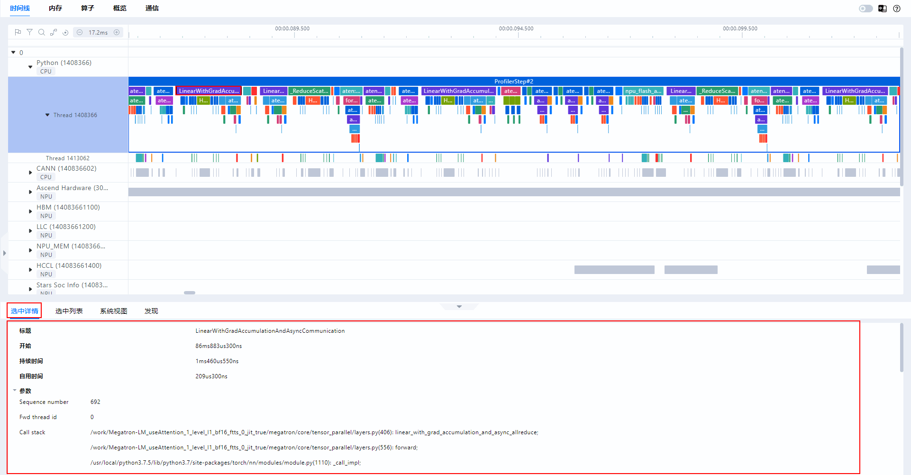

# MindStudio Monitor

## Overview

MindStudio Monitor (msMonitor) is a one-stop online monitoring tool to provide end-to-end performance monitoring and fault locating capabilities in cluster scenarios.

Based on [dynolog](https://github.com/facebookincubator/dynolog), msMonitor provides the **nputrace** and **npu-monitor** functions for users through the dynamic collection capabilities of the AI frameworks [Ascend PyTorch Profiler](<>) and [MindSpore Profiler](<>) and [MSPTI](<>).

- **npu-monitor**: a lightweight, resident background tool that monitors the time consumption of key operators.
- **nputrace**: obtains detailed profile data of the framework, CANN, and devices.


As shown in the preceding figure, msMonitor consists of three parts:

1. **Dynolog daemon**: Each node has only one dynolog daemon process, which is responsible for receiving RPC requests from the dyno CLI, triggering the nputrace and npu-monitor functions, processing reported data, and displaying final data. For details about dynolog, see [dynolog](./docs/en/dynolog_instruct.md).
2. **Dyno CLI**: It is a dyno client that provides nputrace and npu-monitor subcommands for users. It can be installed on any node. For details about dyno, see [dyno](./docs/en/dyno_instruct.md).
3. **MSPTI Monitor**: It is a monitoring submodule implemented based on MSPTI. It obtains profile data by calling the MSPTI APIs and reports the data to the dynolog daemon.

## Directory Structure

The key directories are as follows. For details, see [Project Directory](./docs/en/dir_structure.md).

```ColdFusion
├── docs                    # Project document directory
│   └── en                  # English document directory
├── dynolog_npu             # Code directory of the dynolog_npu module
├── plugin                  # Code directory of the plugin module
├── scripts                 # Directory for storing build and test scripts
│   ├── build.sh            # dynolog_npu build script
│   ├── run_st.sh           # System test script
│   └── run_ut.sh           # Unit test script
├── test                    # Test code
│   ├── st                  # System testing cases
│   └── ut                  # Unit test cases
├── third_party             # Third-party dependency library
└── README.md               # Project description document
```

## Version Description

msMonitor consists of three files, as shown in the following table.

The dyno and dynolog files can be packaged into DEB or RPM packages. Currently, msMonitor can run on the [PyTorch](https://gitcode.com/Ascend/pytorch) and [MindSpore](https://www.mindspore.cn/) frameworks. For details about the latest software packages, see [Version Mapping](#version-mapping).

| File Name                                                                                                 | Description                                                                                                               |
|------------------------------------------------------------------------------------------------------|-------------------------------------------------------------------------------------------------------------------|
| dyno                                                                                                 | Binary files of the dyno client                                                                                                     |
| dynolog                                                                                              | Binary files of the dynolog server                                                                                                  |
| mindstudio_monitor-{mindstudio_version}-cp{python_version}-cp{python_version}-linux_{system_architecture}.whl | Common capability tool packages such as MSPTI Monitor and IPC.*{mindstudio_version}* indicates the MindStudio version, *{python_version}* indicates the Python version, and *{system_architecture}* indicates the CPU architecture.|

**Version Mapping**<a id="version-mapping"></a>

The following table lists the msMonitor version mapping and software package download links.

| msMonitor Version | Release Date  | CANN Version | torch_npu Version| MindSpore Version| Download Link                                                    | Checksum                                                      |
| -------------- | ---------- | ------------- | ----------------- | ----------------- | ------------------------------------------------------------ | ------------------------------------------------------------ |
| 8.3.0(aarch64) | 2025-12-29 | 8.3.RC1 or later| v7.3.0 or later     | 2.7.2 or later  | [aarch64_8.3.0.zip](https://ptdbg.obs.cn-north-4.myhuaweicloud.com/profiler/msmonitor/8.3.0/aarch64_8.3.0.zip) | 2c675ae346dfc1c70f5e9c7103d6f8c7e53be00dca28ed5f9cc577ac59e4bc44 |
| 8.3.0(x86)     | 2025-12-29 | 8.3.RC1 or later| v7.3.0 or later     | 2.7.2 or later  | [x86_8.3.0.zip](https://ptdbg.obs.cn-north-4.myhuaweicloud.com/profiler/msmonitor/8.3.0/x86_8.3.0.zip) | 1a38cc141e67c50eb09ebdc757c1fd3ed54439f227459e71292b2d18bb78e7f0 |
| 8.1.0(aarch64) | 2025-07-11 | 8.1.RC1 or later| v7.1.0 or later     | 2.7.0-rc1 or later  | [aarch64_8.1.0.zip](https://ptdbg.obs.cn-north-4.myhuaweicloud.com/profiler/msmonitor/8.1.0/aarch64_8.1.0.zip) | ce136120c0288291cc0a7803b1efc8c8416c6105e9d54c17ccf2e2510869fada |
| 8.1.0(x86)     | 2025-07-11 | 8.1.RC1 or later| v7.1.0 or later     | 2.7.0-rc1 or later  | [x86_8.1.0.zip](https://ptdbg.obs.cn-north-4.myhuaweicloud.com/profiler/msmonitor/8.1.0/x86_8.1.0.zip) | 097d11c7994793b6389b19259269ceb3b6b7ac5ed77da3949b3f09da2103b7f2 |

## Environment Setup

Install msMonitor. You can install msMonitor by installing the software package or compiling the source code. For details, see [msMonitor Installation Guide](./docs/en/install_guide.md).

You are advised to install msMonitor by installing the software package. The procedure is as follows:

1. Select the software package based on [Version Mapping](#version-mapping) and download it to the Linux installation environment.

2. Verify the package integrity.

   Go to the directory containing the .zip package and run the following command:

   ```bash
   sha256sum {name}.zip
   ```

   *{name}* indicates the name of the .zip package.

   If the command output displays a checksum that matches the corresponding .zip package version, the correct tool installation package has been downloaded. Example:

   ```ColdFusion
   2c675ae346dfc1c70f5e9c7103d6f8c7e53be00dca28ed5f9cc577ac59e4bc44 aarch64_8.3.0.zip
   ```

3. Install the .whl package.

   ```bash
   # Decompress the package.
   mkdir x86
   unzip x86_8.3.0.zip -d x86

   # Go to the directory of the depressed installation package.
   cd x86

   # Install the .whl package that matches the Python version in the current environment.
   pip install mindstudio_monitor-{mindstudio_version}-cp{python_version}-cp{python_version}-linux_{system_architecture}.whl
   ```

   If the installation is successful, the following information is displayed:

   ```ColdFusion
   Successfully installed mindstudio_monitor-<version> pybind11-<version>
   ```

4. Install dynolog.

   Select an installation method based on the server OS.

   - Method 1: Use the .deb software package (applicable to Debian/Ubuntu).

     ```bash
     dpkg -i --force-overwrite dynolog*.deb
     ```

   - Method 2: Use the .rpm software package (applicable to Red Hat/Fedora/openSUSE).

     ```bash
     rpm -ivh dynolog*.rpm --nodeps
     ```

## Quick Start

For details about the npu-monitor and nputrace functions, see [Feature Description](#Feature-Description). The following describes the common application scenarios of msMonitor:

1. Use the npu-monitor function to obtain the time consumed by key operators.
2. If the time consumed by key operators deteriorates, use the nputrace function to collect detailed profile data for analysis.

**Procedure**

1. Start the dynolog daemon process.

   Example commands:

   ```bash
   # Enable the dynolog daemon in CLI mode.
   dynolog --enable-ipc-monitor --certs-dir /home/server_certs

   # To use TensorBoard to display data, pass --metric_log_dir to specify the output path of the TensorBoard file.
   dynolog --enable-ipc-monitor --certs-dir /home/server_certs --metric_log_dir /tmp/metric_log_dir    # The log path of dynolog daemon is /var/log/dynolog.log.
   ```

2. Configure the msMonitor environment variable.

   ```bash
   export MSMONITOR_USE_DAEMON=1
   ```

3. Set `LD_PRELOAD` to start MSPTI (start npu-monitor).

   ```bash
   # Example of the default path: export LD_PRELOAD=/usr/local/Ascend/ascend-toolkit/latest/lib64/libmspti.so
   export LD_PRELOAD=<CANN_toolkit_installation_path>/ascend-toolkit/latest/lib64/libmspti.so
   ```

4. Start a training or inference job.

   ```bash
   bash run_ai_task.sh
   ```

5. Run the `dyno` command to trigger npu-monitor to monitor the time consumed by key operators.

   ```bash
   # Enable npu-monitor, set the reporting period to 30s, and set the reported data type to Kernel.
   dyno --certs-dir /home/client_certs npu-monitor --npu-monitor-start --report-interval-s 30 --mspti-activity-kind Kernel

   # Disable npu-monitor.
   dyno --certs-dir /home/client_certs npu-monitor --npu-monitor-stop
   ```

6. Run the `dyno` command to trigger nputrace to collect detailed trace data. (nputrace can be triggered only after npu-monitor is disabled.)

   ```bash
   # Collect data of two steps starting from the 10th step, including the framework, CANN, and device data. After the collection is complete, the data is automatically analyzed and not simplified. The output path is /tmp/profile_data.
   dyno --certs-dir /home/client_certs nputrace --start-step 10 --iterations 2 --activities CPU,NPU --analyse --data-simplification false --log-file /tmp/profile_data
   ```

## Feature Description <a id="Feature-Description"></a>
>
> [!NOTE]NOTE
>
> Due to low-level resource restrictions, the npu-monitor and nputrace functions cannot be enabled at the same time.

After the **nputrace** or **npu-monitor** command is executed, a JSON character string for `response` is displayed. The `commandStatus` field in the character string indicates whether the command takes effect. `effective` indicates that the command takes effect, and `ineffective` indicates that the command is invalid. Other fields are native fields of dynolog (available only when the status is `effective`).

### Status Query

```bash
dyno --certs-dir <CERT_DIR> status  # The value of --certs-dir must be the same in dyno and dynolog. <CERT_DIR> can be set to the certificate path. If the TLS certificate key is not used, set this parameter to NO_CERTS.
```

After the preceding command is executed, a JSON character string is printed, for example, `{"current_step":1,"npumonitor":"Idle","nputrace":"Ready","start_step":5,"stop_step":10}`.

**State Description**

- `Uninitialized`: The program is not started or is before dynolog init.
- `Idle`: No command is delivered.
- `Ready`: The command has been delivered but the specified step is not reached.
- `Running`: Data is being collected.

**Other Description:**

- The `nputrace` field has four states: `Uninitialized`, `Idle`, `Running`, and `Ready`. The `npumonitor` field has three states: `Uninitialized`, `Idle`, and `Running`.
- `start_step` and `stop_step` indicate the range of the collection step. In the PyTorch framework, the valid collection range is [start_step, stop_step), that is, `start_step` is included but `stop_step` is not included. In the MindSpore framework, the valid collection range is [start_step, stop_step], that is, `stop_step` is included.
- `start_step`** and `stop_step` are printed only when `nputrace` is in the `Running` or `Ready` state.
- The default value of `current_step` is `-1`.
- In the MindSpore framework, `nputrace` does not have the `Ready` state.

### npu-monitor

The npu-monitor feature provides lightweight key metrics monitoring. The npu-monitor is developed based on [MSPTI](<>). Users can use the npu-monitor to view the execution time of compute and communication operators during model running.
For details about how to use the npu-monitor, see [npu-monitor](./docs/en/npumonitor_instruct.md). For details about how to use the msMonitor in the MindSpore framework, see [Using msMonitor in MindSpore](./docs/en/mindspore_adapter_instruct.md).

### nputrace

The nputrace feature provides users with the capability of dynamically triggering the AI frameworks [Ascend PyTorch Profiler](<>) and [MindSpore Profiler](<>) to collect and parse data. That is, after a model is started, the model running does not need to be interrupted, and the profiler can be triggered for multiple times to collect and parse data with different configurations. The collected profile data can be visualized using [MindStudio Insight](<>), as shown in the following figure.
For details, see [nputrace](./docs/en/nputrace_instruct.md). For details about how to use msMonitor in the MindSpore framework, see [Using msMonitor in MindSpore](./docs/en/mindspore_adapter_instruct.md).


### Monitor

Provides easy-to-use APIs to collect profile data of compute operators, communication operators, APIs, Runtime APIs, and MSTX. You can select metrics to be collected as needed. For details, see [Monitor](./docs/en/monitor_feature.md).

## API Reference

[API Reference of the mindstudio_monitor Module](./docs/en/mindstudio_monitor_api_reference.md), including the following feature APIs:

- APIs for interacting with the dynolog component. For details, see "PyDynamicMonitorProxy APIs".
- Monitor feature APIs. For details, see "Monitor Feature APIs".

## FAQs

FAQs summarize the problems that may occur when you use msMonitor. For details, see [FAQs](./docs/en/faq.md).

## How to Contribute

For instructions on reporting issues, requesting features, and contributing code to msMonitor, see [Contributing to MindStudio Monitor](CONTRIBUTING.md).

## Contact Us

[](https://raw.gitcode.com/kali20gakki1/Imageshack/raw/main/CDC0BEE2-8F11-477D-BD55-77A15417D7D1_4_5005_c.jpeg)

## Security Statement

For details about the security hardening information and public network address information of MindStudio Monitor, see [Security Statement](./docs/en/security_statement.md).

## Disclaimer

- This tool is intended solely for debugging and development. Users are responsible for any risks and should carefully review the following information:
  - Data processing and deletion: Users are responsible for managing and deleting any data generated while using this tool. Users are advised to delete such data promptly after use to prevent information leakage.
  - Data confidentiality and transmission: Users understand and agree not to share or transmit any data generated by this tool. Neither the tool nor its developers are responsible for any information leaks, data breaches, or other negative consequences.
  - User input security: Users are responsible for the security of any commands they enter and for any risks or losses resulting from improper input. The tool and its developers are not liable for issues caused by incorrect command usage.
- Disclaimer scope: This disclaimer applies to all individuals and entities using this tool. By using the tool, you acknowledge and accept this statement and assume all risks and responsibilities arising from its use. If you do not agree, please stop using the tool immediately.
- Before using this tool, **please read and understand the preceding disclaimer**. If you have any questions, contact the developer.

## License

For details about the license of MindStudio Monitor, see [LICENSE](./LICENSE).

Documents in the `docs` directory of msMonitor are licensed under CC-BY 4.0. For details, see [LICENSE](docs/LICENSE).

## Acknowledgments

msMonitor is jointly developed by the following Huawei departments:

Huawei:

- Ascend Computing MindStudio Development Department

Thank you to everyone in the community for your PRs. We warmly welcome contributions to msMonitor.
