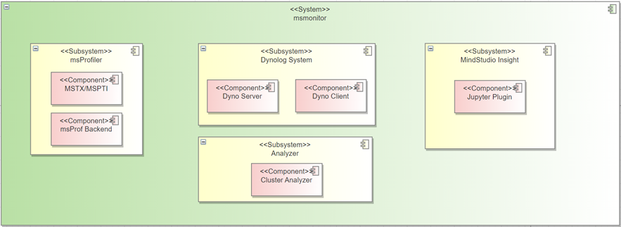

# MindStudio Monitor Feature Analysis and Design Specifications

|                                           |                   |
| ----------------------------------------- | ----------------- |
| SIG group:                                | mstt-sig          |
| Incorporated into the following versions: | MindStudio 26.0.0 |
| Designer:                                 | chenhao           |
| Date:                                     | 2026.01. 21       |

**Copyright © 2022 openGauss Community**

Your reproduction, use, modification and distribution of this document is subject to the Creative Commons Attribution-ShareAlike 4.0 International Public License ("CC BY-SA 4.0"). For ease of understanding, you can visithttps://creativecommons.org/licenses/by-sa/4.0/Understand the overview (but not the replacement) of CC BY-SA 4.0. You can obtain the complete CC BY-SA 4.0 agreement from the following website:https://creativecommons.org/licenses/by-sa/4.0/legalcode.

**Revision records**

| Date        | Revised version | Revision Description | Authors | Audited |
| ----------- | --------------- | -------------------- | ------- | ------- |
| 2026.01. 21 | 1.0             | Completed the draft. | chenhao | chenhao |

# 1. Feature Overview

The online monitoring implements performance monitoring and analysis in the large model cluster scenario. Lightweight dotting monitoring is used to identify slow cards. The dynamic collection capability is used to deeply analyze slow cards and quickly locate and analyze root causes of slow cards in the corresponding communication domain.

## 1.1 Scope

The NPUMonitor capability is enhanced. The NPUMonitor supports the control of the collection period, the control of the collection data range, and the asynchronous parsing capability of the nputrace.

## 1.2 Feature Requirement List

Table 1 List of feature requirements

| Requirement No. | Requirement name                                           | Feature Description                                                                        | Remarks                                                   |
| --------------- | ---------------------------------------------------------- | ------------------------------------------------------------------------------------------ | --------------------------------------------------------- |
| 1               | The npumonitor supports data collection by duration.       | The duration parameter can be set to control the data indicators in the collection period. | The stop parameter can be used to control the early stop. |
| 2               | NPUMonitor supports collection by operator name.           | Operator name rules can be set to filter required operator names.                          | Operator names can be configured based on fuzzy matching. |
| 3               | The nputrace supports the asynchronous parsing capability. | Asynchronous data processing by the parsing thread                                         |                                                           |

# 2. Requirement Scenario Analysis

## 2.1 Feature Requirement Source and Value Overview

The basic capabilities of the msMonitor are improved and enhanced. The msMonitor supports fine-grained control of the collected data scope and customized data processing while controlling the data collection level, improving flexibility and usability.

## 2.2 Feature Scenario Analysis

*Describe the application scenarios of this feature.*

*The contents include:*

1) Scenario triggering conditions and objects: What roles, tools, and interfaces will use the feature in what specific conditions? What are the skills of the users?

2) Describe the main application scenarios, sub-scenarios, and key operations of this feature._

## 2.3 Feature Impact Analysis

*This section describes the position and peripheral interfaces of the feature in the entire system. Describe the key constraints or feature conflicts of the feature.*

*Interaction with other requirements and features:*

*Platform differences: including the hardware platform and operating system*

*Compatibility analysis:*

*Constraints and restrictions:*

### 2.3.1 Hardware Limitations

| Product Type                                | Support |
| ------------------------------------------- | ------- |
| Atlas A3 Series Training/Inference Products | support |
| Atlas A2 Series Training/Inference Products | support |

### 2.3.2 Technical Limitations

Operating system: Linux

Programming language: C/Python

### 2.3.3 Impact on Licenses

NA

### 2.3.4 Impact Analysis on System Performance Specifications

NA

### 2.3.5 Analysis of Impact on System Reliability Specifications

NA

### 2.3.6 Impact on System Compatibility

The new functions, parameters, and capabilities are added. The original functions are not changed and there is no compatibility issue.

### 2.3.7 Impact Analysis on Interaction and Conflicts with Other Key Features

NA

## 2.4 Analysis of implementation solutions for similar community/commercial software

Dynolog enables on-demand performance analysis for distributed AI applications without any code modification. You can initiate a PyTorch performance data collection request through the Dynolog service. Upon receiving the request, Dynolog configures the PyTorch performance analyzer dynamically through inter-process communication (IPC).

The following diagram shows the workflow:

    

Figure 1: Community Programme Implementation Diagram

1. Configure the PyTorch App Environment to enable on-demand trace collection.

2. Collect GPU tracking data locally or remotely on demand.

3. Perform performance analysis on the distributed training task.

# 3. Feature/Function implementation principles (multiple use cases can be broken down)

## 3.1 Objectives

*This section describes the scenarios, specifications, and objectives of the feature.*

## 3.2 Overall Solution

    

Figure 2: Overall logical architecture of the msMonitor solution

MindStudio provides an end-to-end solution based on distributed AI clusters.

**Dynolog System: The Dynolog system is the core subsystem, which consists of the client and server modules. The client sends a command to enable the lightweight dotting monitoring capability. Currently, the following parameters are supported: nputrace (detailed mstx/mspti dotting information) and npumonitor (real-time monitoring metrics and analysis of slow card indicators) Client command parameters are transferred through RPC messages. The server communicates with threads in service processes through IPC Socket, forwards instructions delivered by the client, assembles and distributes commands, configures commands to service processes, and enables or disables services.**

**msProfiler: Starts the lightweight dotting monitoring thread in the training service process to read the mstx/mspti interface buffer data periodically (Xs). The lightweight dotting monitoring thread reports dotting data to the Daemon Server through the IPC Socket.**

**msInsight/Analyzer: The user/platform side collects metrics data through the storage platform. The cluster node data depends on the aggregation capability of the user/platform. The aggregated data can be analyzed by calling the knowledge base or displayed in a visualized manner.**

    

Figure 3: msMonitor Interaction Context View

The MSMonitor involves the following external modules:

1. Developer: The msMonitor provides a command-line interface to dynamically collect user-defined data and enable the capability of enabling preset monitoring data. Developers can quickly obtain cluster performance data through configuration. The environment where the msMonitor is located is the running environment. Developers can configure, start, stop, and analyze the msMonitor.

2. Algorithm frameworks such as Pytorch Profiler: Data collection capability implemented based on the Pytorch framework. Supports data dotting and collection. Provides performance data at the framework layer and CANN layer, and returns the data to the monitoring system for further analysis and display.

3. AI platforms such as MindX: As a running platform, the platform can invoke the command line capability and obtain flushing data for secondary analysis and display. It can also integrate the Insight GUI.

# 4. The MSMonitor collects basic parameters

## 4.1 Design Idea

The parameters of the npumonitor subcommand are extended to flexibly control the collection scope.

1. The extended parameter --duration-ms can specify the collection time range.

2. The extended parameter filter supports the configuration of operator name filtering rules.

## 4.2 Constraints

NA

## 4.3 Detailed implementation (module-level or process-level message sequence diagram from user entry)

*This section describes the use case implementation process. Use the sequence diagram and flowchart to describe the interaction between modules.*

*At the same time, use short words to describe the changes in the allocation requirements of each module of the sequence diagram and flow chart, and use structured language as much as possible.*

## 4.4 Interfaces Between Subsystems (Mainly Covering the Definition of Module Interfaces)

*In this section, you only need to describe the .h interface involved in the modification and briefly describe the modification.*

## 4.5 Detailed Design of Subsystems

*Describe the modifications of each module in detail.*

## 4.6 DFX Attribute Design

### 4.6.1 Performance Design

The filtering rule control in this feature scenario increases the processing time. However, the data volume is significantly reduced, and the I/O load and time consumption are effectively reduced. The impact on performance is controllable.

### 4.6.2 Upgrade and Capacity Expansion Design

New features do not involve upgrade or capacity expansion.

### 4.6.3 Exception Handling Design

To design parameter validity and validity, control and limit the parameter setting range and the reliability and tenacity of validity check to prevent abnormal parameters from affecting the main service process.

### 4.6.4 Resource Management Design

NA

### 4.6.5 Miniaturized Design

NA

### 4.6.6 Testability Design

1. Verify the function of the parameter, including whether the duration time segment collection is invalid and whether the filtering rule takes effect.

2. Verify the parameter combination scenario, including the combination of the duration and stop parameters.

### 4.6.7 Security Design

#### 4.6.7.1 Safety Design Qualification

*Check the security design by referring to the security design checklist.*

| Security attributes                | Check Item                                                                                                                                                   | Check Item Description                                                                                                                                                                                                                                                                                                                                                                                                                                                                                                                                                                                                                                                                                                                                                                                                                                                                                                                                                                                                                                                             | Involved or Not | Satisfied or not |
| ---------------------------------- | ------------------------------------------------------------------------------------------------------------------------------------------------------------ | ---------------------------------------------------------------------------------------------------------------------------------------------------------------------------------------------------------------------------------------------------------------------------------------------------------------------------------------------------------------------------------------------------------------------------------------------------------------------------------------------------------------------------------------------------------------------------------------------------------------------------------------------------------------------------------------------------------------------------------------------------------------------------------------------------------------------------------------------------------------------------------------------------------------------------------------------------------------------------------------------------------------------------------------------------------------------------------- | --------------- | ---------------- |
| Access channel control             | Whether to add a listening port                                                                                                                              | The communication matrix needs to be updated for new listening ports.                                                                                                                                                                                                                                                                                                                                                                                                                                                                                                                                                                                                                                                                                                                                                                                                                                                                                                                                                                                                              | No.             |                  |
| Access channel control             | Whether to add new processes or communication between components                                                                                             | Added the communication matrix between new processes or components.                                                                                                                                                                                                                                                                                                                                                                                                                                                                                                                                                                                                                                                                                                                                                                                                                                                                                                                                                                                                                | No.             |                  |
| Access channel control             | Whether to add an authentication mode                                                                                                                        | The communication matrix and product documentation must be updated for the new authentication mode.                                                                                                                                                                                                                                                                                                                                                                                                                                                                                                                                                                                                                                                                                                                                                                                                                                                                                                                                                                                | No.             |                  |
| Permission control                 | Whether to create a file or directory                                                                                                                        | To create a file or directory, you must explicitly specify the access permission for the file or directory.                                                                                                                                                                                                                                                                                                                                                                                                                                                                                                                                                                                                                                                                                                                                                                                                                                                                                                                                                                        | No.             |                  |
| Permission control                 | Check whether the account permission meets the permission minimization principle.                                                                            | All accounts in the system must be assigned with the least permission.                                                                                                                                                                                                                                                                                                                                                                                                                                                                                                                                                                                                                                                                                                                                                                                                                                                                                                                                                                                                             | No.             |                  |
| Permission control                 | Check whether user privilege escalation exists.                                                                                                              | Unauthorized user privilege escalation is prohibited.                                                                                                                                                                                                                                                                                                                                                                                                                                                                                                                                                                                                                                                                                                                                                                                                                                                                                                                                                                                                                              | No.             |                  |
| Undisclosed Interface              | Whether to add GUC parameters                                                                                                                                | The product documentation needs to be updated for the new GUC parameters.                                                                                                                                                                                                                                                                                                                                                                                                                                                                                                                                                                                                                                                                                                                                                                                                                                                                                                                                                                                                          | No.             |                  |
| Undisclosed Interface              | Add or modify functions, views, and system tables.                                                                                                           | When adding or modifying functions, views, and system tables, the product documentation must be updated and permission control must be considered.                                                                                                                                                                                                                                                                                                                                                                                                                                                                                                                                                                                                                                                                                                                                                                                                                                                                                                                                 | No.             |                  |
| Undisclosed Interface              | Add SQL Syntax                                                                                                                                               | The new SQL syntax needs to be updated in the product documentation to support recording audit logs.                                                                                                                                                                                                                                                                                                                                                                                                                                                                                                                                                                                                                                                                                                                                                                                                                                                                                                                                                                               | No.             |                  |
| Undisclosed Interface              | Whether to add internal tools                                                                                                                                | Product documentation needs to be updated for new internal tools.                                                                                                                                                                                                                                                                                                                                                                                                                                                                                                                                                                                                                                                                                                                                                                                                                                                                                                                                                                                                                  | No.             |                  |
| Undisclosed Interface              | Check whether the script contains comment code.                                                                                                              | Do not comment out code in explanatory languages such as Shell and Python. The comment out code must be deleted.                                                                                                                                                                                                                                                                                                                                                                                                                                                                                                                                                                                                                                                                                                                                                                                                                                                                                                                                                                   | No.             |                  |
| Undisclosed Interface              | Check whether there are access modes such as hidden commands, parameters, and ports.                                                                         | Access modes, such as commands, parameters, and ports, that are not used during maintenance on the live network (including but not limited to product production, commissioning, and maintenance purposes), must be deleted (e.g. by compiling macros)                                                                                                                                                                                                                                                                                                                                                                                                                                                                                                                                                                                                                                                                                                                                                                                                                             | No.             |                  |
| Undisclosed Interface              | Check whether the system has hidden backdoors.                                                                                                               | Do not reserve any undisclosed accounts in the system. All accounts must be managed by the system and must be described in the documentation.                                                                                                                                                                                                                                                                                                                                                                                                                                                                                                                                                                                                                                                                                                                                                                                                                                                                                                                                      | No.             |                  |
| Undisclosed Interface              | It is prohibited to provide cracking and network sniffing tools in the software (including software packages and patch packages) released to external users. | 1. It is prohibited to provide the software (including software packages and patch packages) released to external users that can change the password of any user or have the "password cracking capability". (Virtual-force password cracking and maliciously cracking passwords by exploiting system/algorithm vulnerabilities) 2. A function or tool used to decrypt files containing sensitive data (such as configuration files and databases containing keys). 2. Do not retain third-party network sniffing tools, such as tcpdump, gdb, strace, readelf, and process debugging tools, in the system. CPP, GCC, dexdump, mirror, JDK development/compilation tools, and self-developed debugging tools/scripts used only in the commissioning phase (for example, encryption and decryption scripts, commissioning functions, and commands that can be used only in the commissioning phase), which must be retained due to service requirements, and strict access control is required. In addition, describe the reason, application scenario, and risk for the retention. | No.             |                  |
| Sensitive data protection          | Authentication credentials cannot be stored in the system in plaintext and must be encrypted.                                                                | Authentication credentials (such as passwords and private keys) must be encrypted and cannot be stored in the system in plaintext.                                                                                                                                                                                                                                                                                                                                                                                                                                                                                                                                                                                                                                                                                                                                                                                                                                                                                                                                                 | No.             |                  |
| Sensitive data protection          | The key used for encrypting sensitive data transmission cannot be hard-coded.                                                                                | Hard coding of passwords and keys is prohibited.                                                                                                                                                                                                                                                                                                                                                                                                                                                                                                                                                                                                                                                                                                                                                                                                                                                                                                                                                                                                                                   | No.             |                  |
| Sensitive data protection          | Check whether sensitive information, such as passwords and keys, is printed in plaintext.                                                                    | Do not print sensitive information (passwords, private keys, and pre-shared keys) in plaintext in logs, debugging information, error messages, and ps commands stored in the system.                                                                                                                                                                                                                                                                                                                                                                                                                                                                                                                                                                                                                                                                                                                                                                                                                                                                                               | No.             |                  |
| Sensitive data protection          | Specifies whether to display the password in plaintext.                                                                                                      | Do not display passwords in plaintext.                                                                                                                                                                                                                                                                                                                                                                                                                                                                                                                                                                                                                                                                                                                                                                                                                                                                                                                                                                                                                                             | No.             |                  |
| Sensitive data protection          | Whether the default passwords of third-party and open-source software are used                                                                               | Do not use the default passwords of third-party and open-source software. For details, see section 1.5 in the Security Design Guide.                                                                                                                                                                                                                                                                                                                                                                                                                                                                                                                                                                                                                                                                                                                                                                                                                                                                                                                                               | No.             |                  |
| Sensitive data protection          | Indicates whether to store passwords in plaintext in configuration files.                                                                                    | Plaintext passwords cannot be written into configuration files. (except the scenario where the password must be configured during the installation, deployment, and use of the command-line tool.)                                                                                                                                                                                                                                                                                                                                                                                                                                                                                                                                                                                                                                                                                                                                                                                                                                                                                 | No.             |                  |
| Sensitive data protection          | Whether to use insecure encryption algorithms                                                                                                                | Do not use proprietary or insecure encryption algorithms. Recommended Encryption Algorithm Security Design Guide.                                                                                                                                                                                                                                                                                                                                                                                                                                                                                                                                                                                                                                                                                                                                                                                                                                                                                                                                                                  | No.             |                  |
| Sensitive data protection          | Check whether sensitive information, such as passwords, is transmitted over secure channels.                                                                 | Sensitive information must be transmitted between untrusted networks through secure transmission channels or encrypted transmission. For details, see chapter 10 of the Security Design Guide.                                                                                                                                                                                                                                                                                                                                                                                                                                                                                                                                                                                                                                                                                                                                                                                                                                                                                     | No.             |                  |
| Sensitive data protection          | Check whether sensitive information such as passwords and keys in the memory is destroyed after being used.                                                  | The passwords or keys in the memory are cleared immediately after being used.                                                                                                                                                                                                                                                                                                                                                                                                                                                                                                                                                                                                                                                                                                                                                                                                                                                                                                                                                                                                      | No.             |                  |
| Sensitive data protection          | The random number used in cryptographic algorithm must be the cryptographically defined secure random number.                                                | The random number used in the cryptographic algorithm must be the cryptographically defined secure random number. For details, see section 6.3 in the Security Design Guide.                                                                                                                                                                                                                                                                                                                                                                                                                                                                                                                                                                                                                                                                                                                                                                                                                                                                                                       | No.             |                  |
| Sensitive data protection          | Check whether there are insecure examples in the documentation.                                                                                              | The examples in the documentation must be secure and provide correct guidance for users. If the examples contain potential risks, describe the risks in the documentation.                                                                                                                                                                                                                                                                                                                                                                                                                                                                                                                                                                                                                                                                                                                                                                                                                                                                                                         | No.             |                  |
| Certification                      | Provide authentication mechanism                                                                                                                             | The new system needs to provide the authentication mechanism and the mechanism is enabled by default.                                                                                                                                                                                                                                                                                                                                                                                                                                                                                                                                                                                                                                                                                                                                                                                                                                                                                                                                                                              | No.             |                  |
| Certification                      | Indicates whether authentication is performed on the server.                                                                                                 | The authentication process needs to be performed on the server.                                                                                                                                                                                                                                                                                                                                                                                                                                                                                                                                                                                                                                                                                                                                                                                                                                                                                                                                                                                                                    | No.             |                  |
| Certification                      | Indicates whether the server returns valid information after the authentication fails.                                                                       | After the authentication fails, the information returned by the server does not provide detailed information that can be used to locate the error cause.                                                                                                                                                                                                                                                                                                                                                                                                                                                                                                                                                                                                                                                                                                                                                                                                                                                                                                                           | No.             |                  |
| External parameter validation      | Indicates whether to verify the validity of external input.                                                                                                  | 1. If external input data is used as the loop termination condition, array subscript, and memory allocation parameter, infinite loop, buffer overflow, memory overwriting, and DoS may occur. 2. Verify the validity of external input, such as file paths, to prevent injection risks.                                                                                                                                                                                                                                                                                                                                                                                                                                                                                                                                                                                                                                                                                                                                                                                            | Yes             | Yes              |
| Third-party component introduction | Third-party components are introduced.                                                                                                                       | 1. New third-party components must be scanned by using secure compilation options, viruses, vulnerabilities, open source fragment reference, license compliance, and open source components. For details, see the version release cyber security quality requirements. 2. The source of the new third-party components must be trusted.                                                                                                                                                                                                                                                                                                                                                                                                                                                                                                                                                                                                                                                                                                                                            | Yes             | Yes              |

#### 4.6.7.2 Sensitive Data Analysis

##### 1. Sensitive data list

*The specific scope of sensitive data depends on the specific application scenario of the system. Designers need to analyze and determine the sensitive data based on the risks. Typical sensitive data includes authentication credentials (such as passwords) and keys.*

| **Data field**                 | **Remarks/Descriptions**                           | **Data Field Sensitivity** | **Association processing module** | **Forced action**                                            | **Prohibited operations** |
| ------------------------------ | -------------------------------------------------- | -------------------------- | --------------------------------- | ------------------------------------------------------------ | ------------------------- |
| Administrator Account/Password | User name and password of the system administrator | High                       | Login/Authentication              | Encrypted transmission, encrypted storage, and anonymization | Output and logs           |
| ...                            | ...                                                | ...                        | ...                               | ...                                                          | ...                       |
|                                |                                                    |                            |                                   |                                                              |                           |

##### 2. Check sensitive operations

*1) Lifecycle dimension: For sensitive data identified, we need to identify the lifecycle of the data and identify the process of generation, use, transmission, persistence, and destruction to avoid unintentional omissions in the subsequent risk identification process. 2) High-risk handling process Identify whether sensitive data is handled with high risks. Typical high-risk processing includes printing, echoing, storage, hard coding, and insecure algorithms. From the perspective of information processing, these high-risk processes are prone to security vulnerabilities when sensitive data is processed. Therefore, detailed check is required. All identified sensitive data must be checked. The sensitive data check matrix is as follows:*

For example, in a typical web system, the following table lists the check results of sensitive data (administrator accounts and passwords) in the lifecycle.

 * Generated: The administrator logs in to the system for the first time to set the password.
 * Usage: The administrator uses the password for authentication when logging in to the system.
 * Transmission: After the administrator enters the login password on the client, the password is transmitted to the server through the network.
 * Persistence: After the administrator sets a password for the first time, the server persists the password in the backend database.
 * Destroy: After a specified period, the administrator is forced to change the password and delete the old password.

|                    |                                                               Produced                                                               |                         Use the                          |                                                        Transmission                                                        |                Persistent                 |                                           Destroy                                            |
|:------------------:|:------------------------------------------------------------------------------------------------------------------------------------:|:--------------------------------------------------------:|:--------------------------------------------------------------------------------------------------------------------------:|:-----------------------------------------:|:--------------------------------------------------------------------------------------------:|
|       Print        |                                                            Not involved.                                                             | The password will not be printed in any form during use. | No encryption is required in the secure transmission channel. Encrypted transmission over non-secure transmission channels |               Not involved.               | The password is not printed during the destruction process, but operation logs are recorded. |
|       Output       |             The ciphertext password is displayed on the client, and the password is displayed as \*\*\*\*\*\*\*\*\*\*\*.             |                      Not involved.                       |                                                       Not involved.                                                        |               Not involved.               |                                        Not involved.                                         |
|      Storage       | After a user enters a password, the password is encrypted and saved to the backend database using the security encryption algorithm. |                         congener                         |                                                       Not involved.                                                        | Encrypted storage of the backend database |              Delete the corresponding password from the backend database table.              |
|     Hard-coded     |                                                            Not involved.                                                             |                      Not involved.                       |                                                       Not involved.                                                        |               Not involved.               |                                        Not involved.                                         |
| Insecure algorithm |                                            Encryption using the AES256 security algorithm                                            |              In-memory decryption when used              |                             Non-secure transmission channels use secure encryption algorithms.                             |                 congener                  |                                        Not involved.                                         |

#### 4.6.7.3 Design Implementation

The parameters of the npumonitor subcommand are extended to flexibly control the collection scope.

```rust
NpuMonitor {
        /// Start NPU monitor.
        #[clap(long, action)]
        npu_monitor_start: bool,
        /// Stop NPU monitor.
        #[clap(long, action)]
        npu_monitor_stop: bool,
        /// NPU monitor report interval in seconds.
        #[clap(long, default_value_t = 60)]
        report_interval_s: u32,
        /// MSPTI collect activity kind
        #[clap(long, value_parser = parse_mspti_activity_kinds, default_value = "Marker")]
        mspti_activity_kind: String,
        /// Log file for NPU monitor.
        #[clap(long, default_value = "")]
        log_file: String,
        /// Export type for NPU monitor.
        #[clap(long, value_parser = ["DB", "Jsonl"], default_value = "DB")]
        export_type: String,
        /// TODO
        /// Duration for collecting metrics (--duration_ms)
        /// Filter for OP name (--filter)  
    }
```

 * The extended parameter --duration-ms can specify the collection time range.
 * Extended parameter --filter supports the configuration of operator name filtering rules.

## 4.7 External Interfaces of the System

*Check whether external interfaces, including the GUI parameters, tool usage, SQL syntax, network protocols, system table view functions, and drivers (JDBC/ODBC), are affected.*

## 4.8 Self-Test Case Design

*Describe how to design self-test cases and how to test the functions as expected.*

# 5. Implementation of the asynchronous parsing capability for MSMonitor collection

## 5.1 Design Idea

The parameters of the subcommand nputrace are extended to support the asynchronous parsing process.

1. The extended parameter --async-mode supports data parsing and processing through independent subprocesses, avoiding service process congestion.

## 5.2 Constraints

NA

## 5.3 Detailed implementation (module-level or process-level message sequence diagram from user entry)

*This section describes the use case implementation process. Use the sequence diagram and flowchart to describe the interaction between modules.*

*At the same time, use short words to describe the changes in the allocation requirements of each module of the sequence diagram and flow chart, and try to use structured language.*

## 5.4 Interfaces Between Subsystems (Mainly Covering the Definition of Module Interfaces)

*In this section, you only need to describe the .h interface involved in the modification and briefly describe the modification.*

## 5.5 Subsystem LLD

*Describe the modifications of each module in detail.*

## 5.6 DFX Attribute Design

### 5.6.1 Performance Design

In this scenario, the asynchronous parsing capability is added. Subprocesses are migrated from the main process to process data. The impact on performance is controllable.

### 5.6.2 Upgrade and Capacity Expansion Design

New features do not involve upgrade or capacity expansion.

### 5.6.3 Exception Handling Design

To design parameter validity and validity, control and limit the parameter setting range and the reliability and tenacity of validity check to prevent abnormal parameters from affecting the main service process.

### 5.6.4 Resource Management Design

NA

### 5.6.5 Miniaturized Design

NA

### 5.6.6 Design for testability

1. Verify the parameter functions, including whether the asynchronous parsing capability takes effect.

### 5.6.7 Security Design

#### 5.6.7.1 Safety Design Qualification

*Check the security design by referring to the security design checklist.*

| Security attributes                | Check Item                                                                                                                                                   | Check Item Description                                                                                                                                                                                                                                                                                                                                                                                                                                                                                                                                                                                                                                                                                                                                                                                                                                                                                                                                                                                                                                                                    | Involved or Not | Satisfied or not |
| ---------------------------------- | ------------------------------------------------------------------------------------------------------------------------------------------------------------ | ----------------------------------------------------------------------------------------------------------------------------------------------------------------------------------------------------------------------------------------------------------------------------------------------------------------------------------------------------------------------------------------------------------------------------------------------------------------------------------------------------------------------------------------------------------------------------------------------------------------------------------------------------------------------------------------------------------------------------------------------------------------------------------------------------------------------------------------------------------------------------------------------------------------------------------------------------------------------------------------------------------------------------------------------------------------------------------------- | --------------- | ---------------- |
| Access channel control             | Whether to add a listening port                                                                                                                              | The communication matrix needs to be updated for new listening ports.                                                                                                                                                                                                                                                                                                                                                                                                                                                                                                                                                                                                                                                                                                                                                                                                                                                                                                                                                                                                                     | No.             |                  |
| Access channel control             | Whether to add new processes or inter-component communication                                                                                                | Added the communication matrix between new processes or components.                                                                                                                                                                                                                                                                                                                                                                                                                                                                                                                                                                                                                                                                                                                                                                                                                                                                                                                                                                                                                       | No.             |                  |
| Access channel control             | Whether to add an authentication mode                                                                                                                        | The communication matrix and product documentation must be updated for the new authentication mode.                                                                                                                                                                                                                                                                                                                                                                                                                                                                                                                                                                                                                                                                                                                                                                                                                                                                                                                                                                                       | No.             |                  |
| Permission control                 | Whether to create a file or directory                                                                                                                        | To create a file or directory, you must explicitly specify the access permission for the file or directory.                                                                                                                                                                                                                                                                                                                                                                                                                                                                                                                                                                                                                                                                                                                                                                                                                                                                                                                                                                               | No.             |                  |
| Permission control                 | Check whether the account permission meets the permission minimization principle.                                                                            | All accounts in the system must be assigned with the least permission.                                                                                                                                                                                                                                                                                                                                                                                                                                                                                                                                                                                                                                                                                                                                                                                                                                                                                                                                                                                                                    | No.             |                  |
| Permission control                 | Check whether user privilege escalation exists.                                                                                                              | Unauthorized user privilege escalation is prohibited.                                                                                                                                                                                                                                                                                                                                                                                                                                                                                                                                                                                                                                                                                                                                                                                                                                                                                                                                                                                                                                     | No.             |                  |
| Undisclosed Interface              | Whether to add GUC parameters                                                                                                                                | The product documentation needs to be updated for the new GUC parameters.                                                                                                                                                                                                                                                                                                                                                                                                                                                                                                                                                                                                                                                                                                                                                                                                                                                                                                                                                                                                                 | No.             |                  |
| Undisclosed Interface              | Add or modify functions, views, and system tables.                                                                                                           | When adding or modifying functions, views, and system tables, the product documentation must be updated and permission control must be considered.                                                                                                                                                                                                                                                                                                                                                                                                                                                                                                                                                                                                                                                                                                                                                                                                                                                                                                                                        | No.             |                  |
| Undisclosed Interface              | Add SQL Syntax                                                                                                                                               | The new SQL syntax needs to be updated in the product documentation to support recording audit logs.                                                                                                                                                                                                                                                                                                                                                                                                                                                                                                                                                                                                                                                                                                                                                                                                                                                                                                                                                                                      | No.             |                  |
| Undisclosed Interface              | Whether to add internal tools                                                                                                                                | The product documentation needs to be updated for new internal tools.                                                                                                                                                                                                                                                                                                                                                                                                                                                                                                                                                                                                                                                                                                                                                                                                                                                                                                                                                                                                                     | No.             |                  |
| Undisclosed Interface              | Check whether the script contains comment code.                                                                                                              | Do not comment out code in explanatory languages such as Shell and Python. The comment out code must be deleted.                                                                                                                                                                                                                                                                                                                                                                                                                                                                                                                                                                                                                                                                                                                                                                                                                                                                                                                                                                          | No.             |                  |
| Undisclosed Interface              | Check whether there are access modes such as hidden commands, parameters, and ports.                                                                         | Access modes, such as commands, parameters, and ports, that are not used during live network maintenance (including but not limited to product production, commissioning, and maintenance purposes), must be deleted (e.g. by compiling macros)                                                                                                                                                                                                                                                                                                                                                                                                                                                                                                                                                                                                                                                                                                                                                                                                                                           | No.             |                  |
| Undisclosed Interface              | Check whether the system has hidden backdoors.                                                                                                               | Do not reserve any undisclosed accounts in the system. All accounts must be managed by the system and must be described in the documentation.                                                                                                                                                                                                                                                                                                                                                                                                                                                                                                                                                                                                                                                                                                                                                                                                                                                                                                                                             | No.             |                  |
| Undisclosed Interface              | It is prohibited to provide cracking and network sniffing tools in the software (including software packages and patch packages) released to external users. | 1. It is prohibited to provide the software (including software packages and patch packages) released to external users that can change the password of any user or have the "password cracking capability". (Brute force cracking of passwords and malicious cracking of passwords by exploiting system/algorithm vulnerabilities) 2. A function or tool used to decrypt files that contain sensitive data (such as configuration files and databases that contain keys). 2. Do not retain third-party network sniffing tools, such as tcpdump, gdb, strace, readelf, and process debugging tools, in the system. CPP, GCC, dexdump, mirror, JDK development/compilation tools, and self-developed debugging tools/scripts used only in the commissioning phase (for example, encryption and decryption scripts, commissioning functions, and commands that can be used only in the commissioning phase), which must be retained due to service requirements, and strict access control is required. In addition, describe the reason, application scenario, and risk for the retention. | No.             |                  |
| Sensitive data protection          | Authentication credentials cannot be stored in the system in plaintext and must be encrypted.                                                                | Authentication credentials (such as passwords and private keys) must be encrypted and cannot be stored in the system in plaintext.                                                                                                                                                                                                                                                                                                                                                                                                                                                                                                                                                                                                                                                                                                                                                                                                                                                                                                                                                        | No.             |                  |
| Sensitive data protection          | The key used for encrypting sensitive data transmission cannot be hard-coded.                                                                                | Hard coding of passwords and keys is prohibited.                                                                                                                                                                                                                                                                                                                                                                                                                                                                                                                                                                                                                                                                                                                                                                                                                                                                                                                                                                                                                                          | No.             |                  |
| Sensitive data protection          | Check whether sensitive information, such as passwords and keys, is printed in plaintext.                                                                    | Do not print sensitive information (passwords, private keys, and pre-shared keys) in plaintext in logs, debugging information, error messages, and ps commands stored in the system.                                                                                                                                                                                                                                                                                                                                                                                                                                                                                                                                                                                                                                                                                                                                                                                                                                                                                                      | No.             |                  |
| Sensitive data protection          | Specifies whether to display the password in plaintext.                                                                                                      | Do not display passwords in plaintext.                                                                                                                                                                                                                                                                                                                                                                                                                                                                                                                                                                                                                                                                                                                                                                                                                                                                                                                                                                                                                                                    | No.             |                  |
| Sensitive data protection          | Whether the default passwords of third-party and open-source software are used                                                                               | Do not use the default passwords of third-party and open-source software. For details, see section 1.5 in the Security Design Guide.                                                                                                                                                                                                                                                                                                                                                                                                                                                                                                                                                                                                                                                                                                                                                                                                                                                                                                                                                      | No.             |                  |
| Sensitive data protection          | Indicates whether to store passwords in plaintext in configuration files.                                                                                    | Plaintext passwords cannot be written into configuration files. (except the scenario where the password must be configured during the installation, deployment, and use of the command-line tool.)                                                                                                                                                                                                                                                                                                                                                                                                                                                                                                                                                                                                                                                                                                                                                                                                                                                                                        | No.             |                  |
| Sensitive data protection          | Whether to use insecure encryption algorithms                                                                                                                | Do not use proprietary or insecure encryption algorithms. Recommended Encryption Algorithm Security Design Guide.                                                                                                                                                                                                                                                                                                                                                                                                                                                                                                                                                                                                                                                                                                                                                                                                                                                                                                                                                                         | No.             |                  |
| Sensitive data protection          | Check whether sensitive information, such as passwords, is transmitted over secure channels.                                                                 | Sensitive information must be transmitted between untrusted networks through secure transmission channels or encrypted transmission. For details, see chapter 10 of the Security Design Guide.                                                                                                                                                                                                                                                                                                                                                                                                                                                                                                                                                                                                                                                                                                                                                                                                                                                                                            | No.             |                  |
| Sensitive data protection          | Check whether sensitive information such as passwords and keys in the memory is destroyed after being used.                                                  | The passwords or keys in the memory are cleared immediately after being used.                                                                                                                                                                                                                                                                                                                                                                                                                                                                                                                                                                                                                                                                                                                                                                                                                                                                                                                                                                                                             | No.             |                  |
| Sensitive data protection          | The random number used in cryptographic algorithm must be the cryptographically defined secure random number.                                                | The random number used in the cryptographic algorithm must be the cryptographic secure random number. For details, see section 6.3 in the Security Design Guide.                                                                                                                                                                                                                                                                                                                                                                                                                                                                                                                                                                                                                                                                                                                                                                                                                                                                                                                          | No.             |                  |
| Sensitive data protection          | Check whether there are insecure examples in the documentation.                                                                                              | The examples in the documentation must be secure and provide correct guidance for users. If the examples contain potential risks, describe the risks in the documentation.                                                                                                                                                                                                                                                                                                                                                                                                                                                                                                                                                                                                                                                                                                                                                                                                                                                                                                                | No.             |                  |
| Certification                      | Provide authentication mechanism                                                                                                                             | The new system needs to provide the authentication mechanism and the authentication mechanism is enabled by default.                                                                                                                                                                                                                                                                                                                                                                                                                                                                                                                                                                                                                                                                                                                                                                                                                                                                                                                                                                      | No.             |                  |
| Certification                      | Whether authentication is performed on the server                                                                                                            | The authentication process needs to be performed on the server.                                                                                                                                                                                                                                                                                                                                                                                                                                                                                                                                                                                                                                                                                                                                                                                                                                                                                                                                                                                                                           | No.             |                  |
| Certification                      | Indicates whether the server returns valid information after the authentication fails.                                                                       | After the authentication fails, the information returned by the server does not provide detailed information that can be used to locate the error cause.                                                                                                                                                                                                                                                                                                                                                                                                                                                                                                                                                                                                                                                                                                                                                                                                                                                                                                                                  | No.             |                  |
| External parameter verification    | Indicates whether to verify the validity of external input.                                                                                                  | 1. If external input data is used as the loop termination condition, array subscript, and memory allocation parameter, infinite loop, buffer overflow, memory overwriting, and DoS may occur. 2. Verify the validity of external input, such as file paths, to prevent injection risks.                                                                                                                                                                                                                                                                                                                                                                                                                                                                                                                                                                                                                                                                                                                                                                                                   | Yes             | Yes              |
| Third-party component introduction | Third-party components are introduced.                                                                                                                       | 1. New third-party components must be scanned by using secure compilation options, viruses, vulnerabilities, open source fragment reference, license compliance, and open source components. For details, see the version release cyber security quality requirements. 2. The source of the new third-party components must be trusted.                                                                                                                                                                                                                                                                                                                                                                                                                                                                                                                                                                                                                                                                                                                                                   | Yes             | Yes              |

#### 5.6.7.2 Sensitive Data Analysis

##### 1. Sensitive data list

*The specific scope of sensitive data depends on the specific application scenario of the system. Designers need to analyze and determine the sensitive data based on risks. Typical sensitive data includes authentication credentials (such as passwords) and keys.*

| **Data field**                 | **Remarks/Descriptions**                           | **Data Field Sensitivity** | **Association processing module** | **Enforced action**                                          | **Forbidden operations** |
| ------------------------------ | -------------------------------------------------- | -------------------------- | --------------------------------- | ------------------------------------------------------------ | ------------------------ |
| Administrator Account/Password | User name and password of the system administrator | High                       | Login/Authentication              | Encrypted transmission, encrypted storage, and anonymization | Output and logs          |
| ...                            | ...                                                | ...                        | ...                               | ...                                                          | ...                      |
|                                |                                                    |                            |                                   |                                                              |                          |

##### 2. Check sensitive operations

*1) Lifecycle dimension: For sensitive data identified, we need to identify the lifecycle of the data and identify the process of generation, use, transmission, persistence, and destruction to avoid unintentional omissions in the subsequent risk identification process. 2) High-risk handling process Identify whether sensitive data is handled with high risks. Typical high-risk processing includes printing, echoing, storage, hard coding, and insecure algorithms. From the perspective of information processing, these high-risk processes are prone to security vulnerabilities when sensitive data is processed. Therefore, the sensitive data needs to be checked in detail. The sensitive data check matrix is as follows:*

For example, in a typical web system, the following table lists the check results of sensitive data (administrator accounts and passwords) in the lifecycle.

 * Generated: The administrator sets the password when logging in to the system for the first time.
 * Usage: The administrator uses the password for authentication when logging in to the system.
 * Transmission: After the administrator enters the login password on the client, the password is transmitted to the server through the network.
 * Persistence: After the administrator sets a password for the first time, the server persists the password in the backend database.
 * Destroy: After a specified period, the administrator is forced to change the password and delete the old password.

|                    |                                                               Produced                                                               |                         Use the                          |                                                        Transmission                                                        |                Persistence                |                                       Destroy                                        |
|:------------------:|:------------------------------------------------------------------------------------------------------------------------------------:|:--------------------------------------------------------:|:--------------------------------------------------------------------------------------------------------------------------:|:-----------------------------------------:|:------------------------------------------------------------------------------------:|
|       print        |                                                            Not involved.                                                             | The password will not be printed in any form during use. | No encryption is required in the secure transmission channel. Encrypted transmission over non-secure transmission channels |               Not involved.               | The password is not printed during the destruction, but operation logs are recorded. |
|       Output       |                 The ciphertext password is displayed on the client, and the password is displayed as \*\*\*\*\*\*\*.                 |                      Not involved.                       |                                                       Not involved.                                                        |               Not involved.               |                                    Not involved.                                     |
|      Storage       | After a user enters a password, the password is encrypted and saved to the backend database using the security encryption algorithm. |                         congener                         |                                                       Not involved.                                                        | Encrypted storage of the backend database |          Delete the corresponding password from the backend database table.          |
|     Hard-coded     |                                                            Not involved.                                                             |                      Not involved.                       |                                                       Not involved.                                                        |               Not involved.               |                                    Not involved.                                     |
| Insecure algorithm |                                            Encryption using the AES256 security algorithm                                            |              In-memory decryption when used              |                             Non-secure transmission channels use secure encryption algorithms.                             |                homogenized                |                                    Not involved.                                     |

#### 5.6.7.3 Design Implementation

The parameters of the npumonitor subcommand are extended to flexibly control the collection scope.

```rust
Nputrace {
        /// Job id of the application to trace.
        #[clap(long, default_value_t = 0)]
        job_id: u64,
        /// List of pids to capture trace for (comma separated).
        #[clap(long, value_parser = validate_string_max_len, default_value = "0")]
        pids: String,
        /// Duration of trace to collect in ms.
        #[clap(long, default_value_t = 500)]
        duration_ms: u64,
        /// Training iterations to collect, this takes precedence over duration.
        #[clap(long, value_parser = parse_iterations, allow_negative_numbers = true)]
        iterations: i64,
        /// Log file for trace.
        #[clap(long)]
        log_file: String,
        /// Unix timestamp used for synchronized collection (milliseconds since epoch).
        #[clap(long, default_value_t = 0)]
        profile_start_time: u64,
        /// Number of steps to start profile, -1 means start from next step.
        #[clap(long, value_parser = parse_start_step, allow_negative_numbers = true)]
        start_step: i64,
        /// Max number of processes to profile.
        #[clap(long, default_value_t = 3)]
        process_limit: u32,
        /// Whether to record PyTorch operator input shapes and types.
        #[clap(long, action)]
        record_shapes: bool,
        /// Whether to profile PyTorch memory.
        #[clap(long, action)]
        profile_memory: bool,
        /// Whether to profile the Python call stack in trace.
        #[clap(long, action)]
        with_stack: bool,
        /// Annotate operators with analytical flops.
        #[clap(long, action)]
        with_flops: bool,
        /// Whether to profile PyTorch operator modules in traces.
        #[clap(long, action)]
        with_modules: bool,
        /// The scope of the profile's events.
        #[clap(long, value_parser = ["CPU, NPU", "NPU, CPU", "CPU", "NPU"], default_value = "CPU, NPU")]
        activities: String,
        /// Profiler level.
        #[clap(long, value_parser = ["Level0", "Level1", "Level2", "Level_none"], default_value = "Level0")]
        profiler_level: String,
        /// AIC metrics.
        #[clap(long, value_parser = ["AiCoreNone", "PipeUtilization", "ArithmeticUtilization", "Memory", "MemoryL0", "ResourceConflictRatio", "MemoryUB", "L2Cache", "MemoryAccess"], default_value = "AiCoreNone")]
        aic_metrics: String,
        /// Whether to analyse the data after collection.
        #[clap(long, action)]
        analyse: bool,
        /// Whether to collect L2 cache.
        #[clap(long, action)]
        l2_cache: bool,
        /// Whether to collect op attributes.
        #[clap(long, action)]
        op_attr: bool,
        /// Whether to enable MSTX.
        #[clap(long, action)]
        msprof_tx: bool,
        /// GC detect threshold.
        #[clap(long)]
        gc_detect_threshold: Option<f32>,
        /// Whether to streamline data after analyse is complete.
        #[clap(long, value_parser = ["true", "false"], default_value = "true")]
        data_simplification: String,
        /// Types of data exported by the profiler.
        #[clap(long, value_parser = ["Text", "Db"], default_value = "Text")]
        export_type: String,
        /// Obtain the system data on the host side.
        #[clap(long, value_parser = parse_host_sys, default_value = "None")]
        host_sys: String,
        /// Whether to enable sys io.
        #[clap(long, action)]
        sys_io: bool,
        /// Whether to enable sys interconnection.
        #[clap(long, action)]
        sys_interconnection: bool,
        /// The domain that needs to be enabled in mstx mode.
        #[clap(long)]
        mstx_domain_include: Option<String>,
        /// Domains that do not need to be enabled in mstx mode.
        #[clap(long)]
        mstx_domain_exclude: Option<String>,
        /// TODO
        /// Mode for data analyze (--async-mode)
    }
```

 * The extended parameter --async-mode supports the asynchronous parsing capability.

## 5.7 External Interfaces

*Check whether external interfaces, including GUC parameters, tool usage, SQL syntax, network protocols, system table view functions, and drivers (JDBC/ODBC), are affected.*

## 5.8 Self-Test Case Design

*Describes how to design self-test cases and how to test functions to ensure that functions meet expectations.*

# 6. Reliability and availability design

## 6.1 Redundancy Design

NA

## 6.2 Fault Management

NA

## 6.3 Overload control design

NA

## 6.4 Upgrade Without Service Interruption

*Services are not interrupted during the internal upgrade of a feature. The main considerations are message compatibility, configuration data format compatibility, interface compatibility, dependency between the feature and peripheral features, and quick rollback in the case of upgrade failure.*

## 6.5 Design of human error

NA

## 6.6 Fault Prediction and Prevention Design

*This feature provides data collection and statistics interfaces for the system fault prediction and prevention capability. For example, disk space detection.*

# 7. Design for features and non-functional quality attributes

## 7.1 Testability

*Describe the test direction and specifications of the feature, and describe the aspects that should be tested by the test personnel, and the boundary values, abnormal values, and abnormal scenarios that need to be noted.*

## 7.2 Serviceability

*Provides various maintainable and serviceable measures for features, and provides complete documentation for using, maintaining, and troubleshooting features.*

## 7.3 Evolvability

*Focus on the evolvability of the feature architecture and functions.*

## 7.4 Openness

*Focus on the openness of external interfaces, including the standardization of interfaces, for example, compliance with the SQL 2011 standard.*

## 7.5 Compatibility

*Focus on whether the feature affects the forward compatibility of the system, that is, whether the old functions are available after the upgrade and whether the usage behavior is consistent with that of the old version.*

## 7.6 Scalability/Scalability

*This feature effectively meets the requirements for system capacity changes, including scaling of database nodes and database servers.*

## 7.7 Maintainability

*Focus on feature maintainability, such as diagnosis view and log printing.*

# 8. (Optional) Data Structure Design

*This section describes how to design the database structure. (The database system table structure can be completed by using the Power Designer.) (Optional)*
