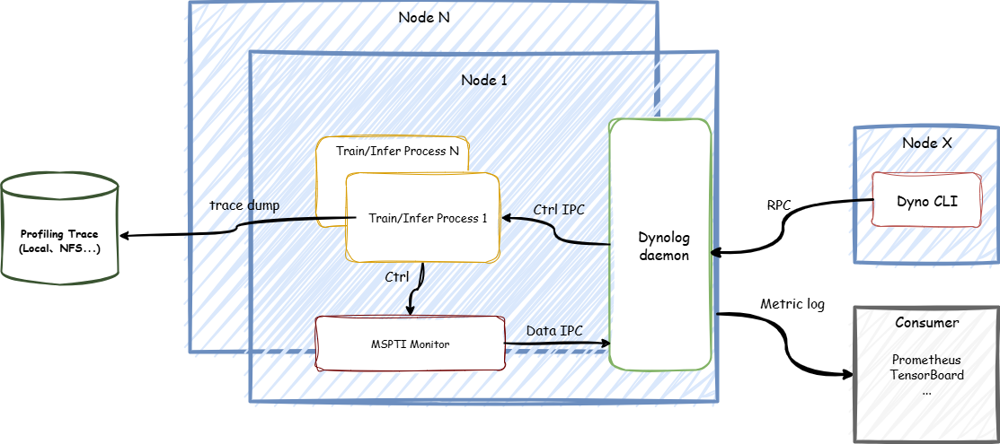

# Overview

<!-- md-trans-meta sourceCommit=unknown translatedAt=2026-06-25T02:21:32.909Z pushedAt=2026-06-25T03:36:31.320Z -->

## Introduction

MindStudio Monitor (msMonitor) is an online performance monitoring and dynamic collection tool designed for Ascend cluster scenarios. Built on [dynolog](https://github.com/facebookincubator/dynolog) and [msPTI](https://gitcode.com/Ascend/mspti/blob/26.0.0/docs/en/getting_started/quick_start.md), it supports capabilities such as `npu-monitor`, `nputrace`, and `Monitor API`.

Supported framework Profiler tools: [Ascend PyTorch Profiler](https://gitcode.com/Ascend/pytorch/blob/v2.7.1-26.0.0/docs/en/ascend_pytorch_profiler/ascend_pytorch_profiler_user_guide.md) and [MindSpore Profiler](https://gitcode.com/Ascend/docs/blob/master/MindStudio/26.0.0/en/menu/mindspore_profiler_user_guide.md)

  
As shown in the figure above, the core components of msMonitor are as follows:

| Component         | Purpose                                                      | Documentation                    |
| ----------------- | ------------------------------------------------------------ | -------------------------------- |
| `Dynolog daemon`  | Server-side daemon process responsible for receiving dyno requests and triggering monitoring and collection. | [dynolog](./dynolog_instruct.md) |
| `Dyno CLI`        | Client-side command-line entry for issuing `npu-monitor` and `nputrace` commands. | [dyno](./dyno_instruct.md)       |
| `MSPTI Monitor`   | Collection module based on msPTI, responsible for acquiring and reporting profile data. | -                                |

## Feature Introduction

msMonitor provides the following core features:

| Feature Name    | Feature Description                                          | Documentation                           |
| --------------- | ------------------------------------------------------------ | --------------------------------------- |
| `npu-monitor`   | A lightweight daemon that runs in the background and continuously monitors the latency of key operators, suitable for online performance fluctuation observation. | [npu-monitor](./npumonitor_instruct.md) |
| `nputrace`      | Dynamically triggers the collection and parsing of profile data from the framework, CANN, and device sides without interrupting running tasks. | [nputrace](./nputrace_instruct.md)      |
| `Monitor API`   | Provides Python APIs to collect profile data for compute operators, communication operators, APIs, Runtime APIs, Mstx, and more. | [Monitor API](./monitor_feature.md)     |
